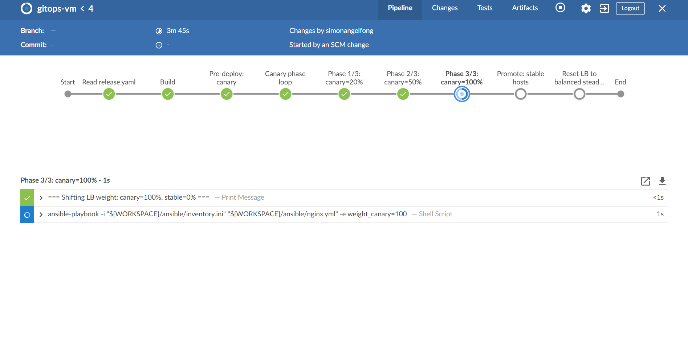
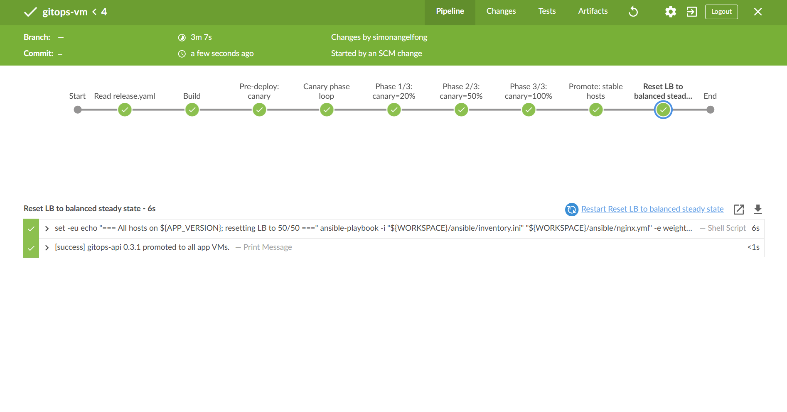

# GitOps VM: Test - Happy Path

[Back](../README.md)

- [GitOps VM: Test - Happy Path](#gitops-vm-test---happy-path)
  - [Test - Happy Path](#test---happy-path)

---

## Test - Happy Path

- stable version

```sh
# app/VERSION: replace contents
echo "0.3.1" > app/VERSION

cat app/VERSION                              # -> 0.3.1
grep -E 'version|build_healthy' deploy/release.yaml
# expect:  version: "0.3.0"
#          build_healthy: true

# Commit + push
git add app/VERSION deploy/release.yaml
git commit -m "release: 0.3.1"
git push
```





- Confirm

```sh
# jump
curl -s app-vm1:8080
# {"app":"VM GitOps Practices","host":"ip-10-0-20-11","version":"0.3.1"}
curl -s app-vm2:8080
# {"app":"VM GitOps Practices","host":"ip-10-0-20-12","version":"0.3.1"}

# test lb public ip
curl -s 3.98.220.13
# {"app":"VM GitOps Practices","host":"ip-10-0-20-11","version":"0.3.1"}
curl -s 3.98.220.13
# {"app":"VM GitOps Practices","host":"ip-10-0-20-12","version":"0.3.1"}
```
